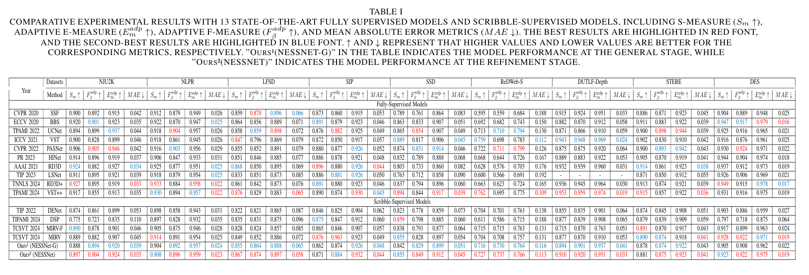

# NESS-Net

## Description

This is the specific implementation of our paper: "NESS-Net: A NAMLab Edge-Guided and Scribble-Supervised Swin-Transformer Net for RGB-D SOD."

## Environmental Setups

python ≥  3.8  pytorch ≥  1.13  

```bash
conda create -n NESS_Net python=3.8
conda activate NESS_Net
pip install -r requirements.txt
```

## Train and Test

### Datasets

We provide [download link](https://pan.baidu.com/s/1LzqQdXzMX5KlTzPig__sOg) for the test dataset, and [download link](https://pan.baidu.com/s/127EpOvMOUlZxlTjByX66Lw) for train dataset. The extraction code is `ness`.

After unzipping, please move the folders in the test set to `./dataset/test_data`, and the folders in the training set to `./dataset/train_data`.

### Pretrained Models

We provide the parameter file for [Swin-B](https://pan.baidu.com/s/1J_inJbuq7yHsF-vqAnW2Qg), as well as the trained model parameter files for the [general stage](https://pan.baidu.com/s/1j7gSNAUQWXWcpWVLw8KtuA) and [refinement stage](https://pan.baidu.com/s/172XRL8YZVOjjfJsfdkfCNg) for replication purposes. The extraction code is `ness`.

Place the Swin-B model parameter file in the current directory, and place the model parameter files for both the general stage and refinement stage into the checkpoints folder.

---

Then, during the general stage, we use the following command to train:

```bash
python train.py --output_dir ./checkpoints --general_stage
```

During the refinement stage, we use the following command to train:

```bash
python train.py --output_dir ./checkpoints --general_model ./checkpoints/NESS_general_35.pth --general_stage
```

To test the model from the general stage, we use the following command:

```bash
python test.py --model_path ./checkpoints/NESS_general_35.pth --general_stage
```

To test the model from the refinement stage, we use the following command:

```bash
python test.py --model_path ./checkpoints/NESS_refinement_30.pth
```

## Evaluation

We provide a tool to evaluate our model’s performance. Use the following command to evaluate the performance metrics of the predicted results. In our paper, the “adp” metric is used and any extra decimal places are truncated.

```bash
cd ./eval
python main.py
```

## NAMLab boundary data preparation

refer to [NAMLab](https://github.com/YunpingZheng/NAMLab)

### NAMLAB environment[](https://github.com/CrownOfStars/NGSNet#config-namlab-environment)

refer to [opencv-install](https://waltpeter.github.io/open-cv-basic/install-opencv-ubuntu-cpp/index.html)

refer to [matlab-install](https://blog.csdn.net/mziing/article/details/122422397)

### Convert NAMLab Hierarchical Image Segmentation map to NAMLab boundary map

## Results
                                    



